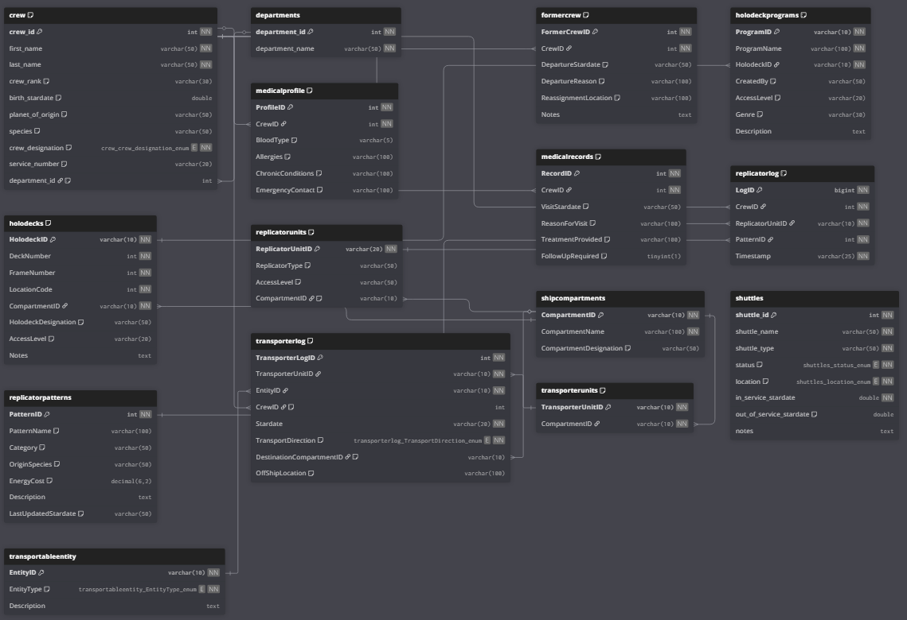

# voyager-database  
Star Trek Voyager Database (LCARS-Themed Project)

This repository contains a fully structured Star Trek Voyager–inspired relational database designed for interactive applications, LCARS-themed user interfaces, and future API development.

The project provides a clean, normalized, game-ready dataset that reflects the inner workings of a Federation starship, including crew information, ship compartments, replicator systems, transporter activity, and medical records.

The database currently includes a complete schema and an initial reference data set, and is being expanded gradually into a full backend system suitable for a text-based RPG, UI dashboard, or investigative toolkit.

---

## Project Goals

- Build a normalized SQL database inspired by the USS Voyager  
- Support log-driven gameplay, queries, and system simulation  
- Enable future LCARS-style front-end interaction  
- Provide a foundation for REST API access  
- Maintain a clearly documented schema and ERD  

---

## Repository Structure
## Repository Structure

```text
voyager-database/
├── api/                  # Python backend API (FastAPI-style structure)
│   ├── src/
│   │   ├── core/          # Configuration and core settings
│   │   ├── database/      # Database connection and session handling
│   │   ├── models/        # ORM / data models (in progress)
│   │   ├── routes/        # API route modules (crew, systems, transporters, etc.)
│   │   ├── utils/         # Shared helpers and utilities
│   │   └── main.py        # API entry point
│   ├── requirements.txt
│   └── README.md
│
├── frontend/             # React frontend (early-stage UI)
│   ├── public/
│   ├── src/
│   ├── package.json
│   └── README.md
│
├── docs/                 # Project documentation
│   ├── ERD/               # Entity-Relationship Diagrams and design notes
│   └── roadmap.md        # Project roadmap and milestones
│
├── sql/                  # Database definitions
│   ├── schema/
│   │   └── v1/            # Versioned schema files
│   └── seed/              # Reference and seed data
│
├── LICENSE
└── README.md


---

## Current Core Database Schema

The database currently supports the following core systems.

### Crew System
- Master crew roster supporting human and alien species  
- Department-based assignment and role structure  
- Service numbers and designations  
- Former crew tracking for transfers or departures  

### Ship Compartment System
- Detailed compartment location codes  
- Named compartments with functional designations  
- Centralized location reference used by ship systems  

### Replicator System
- Replicator units with access levels and locations  
- Replicator patterns and energy usage  
- Replicator usage logging  

### Transporter System
- Transporter units mapped to ship compartments  
- Transportable entity definitions  
- Transporter logs for personnel and cargo movement  

### Shuttle System
- Shuttle registry with service status and location tracking  

### Medical System
- Medical profiles linked to crew members  
- Medical records for sickbay visits and treatments  

Some earlier experimental tables have been retired to keep the schema focused and maintainable.

A detailed explanation of each table is provided in:
docs/ERD/ERD_DESCRIPTION.md

---

## Entity Relationship Diagram (ERD)

The complete Entity Relationship Diagram for the current schema is shown below.



This diagram reflects the full normalized structure of the database as implemented.

---

## Reference Data

This repository includes a starter data pack containing:
- Initial crew roster (including Season 1 personnel)  
- Departments  
- Ship compartments with realistic location codes  

The reference data is provided in:
sql/seed/voyager_reference_data.sql


This allows the database to be recreated with meaningful data rather than empty tables.

---

## Project Roadmap

The current development roadmap is documented in:
docs/roadmap.md


Active and upcoming work includes:
- Final schema validation and cleanup  
- API structure definition  
- LCARS-style UI layout planning  
- Backend and frontend technology selection  

---

## Technologies

| Layer     | Tooling |
|----------|---------|
| Database | MySQL 8 |
| API      | Node/Express or Python/FastAPI (TBD) |
| UI       | LCARS-themed HTML/CSS/React |
| Tools    | VS Code, SQLTools, GitHub Projects |

---
Voyager Database API (v0.1)
Overview

The Voyager Database API is a backend service built with FastAPI and MySQL that provides read-only access to structured data related to the starship Voyager. This project is designed as a learning-focused but production-minded backend system, emphasizing clean API design, database integration, and version-controlled development.

Version v0.1 focuses on establishing a stable API foundation and core read-only endpoints.

Technology Stack

Python

FastAPI

MySQL

PyMySQL

Uvicorn

Current Features (v0.1)

Health check endpoint

MySQL database connectivity using environment variables

Read-only Crew API backed by the database

No write operations (GET-only API)

Available Endpoints
Health
GET /health


Returns API status.

Example response:

{
  "status": "ok"
}

Crew List
GET /crew


Returns a list of crew members from the database.

Example response:

[
  {
    "id": 1,
    "name": "Crew Member A",
    "rank": "LTJG",
    "department": "Operations"
  }
]

Crew Detail
GET /crew/{id}


Returns a single crew member by ID.

Example error response:

{
  "error": "Crew member not found"
}

Setup (Local Development)
Environment Variables

The API requires the following environment variables to connect to MySQL:

DB_HOST=localhost
DB_USER=your_mysql_user
DB_PASSWORD=your_mysql_password
DB_NAME=Voyager_Database

Run the API
uvicorn main:app --reload


Swagger UI will be available at:

http://127.0.0.1:8000/docs

Project Status

API is functional and database-backed

Read-only endpoints only

No authentication implemented

No frontend included in v0.1

Roadmap (Next Steps)

Frontend initialization (React)

Crew list UI

Frontend ↔ Backend integration

Additional read-only endpoints

Pagination and filtering
---
## Contributions

This is a personal development and worldbuilding project.  
Issues, suggestions, and design feedback are welcome, particularly around schema design and LCARS-style UI concepts.

---

## License

MIT License — free to use and modify.

---

## Final Notes

This project is designed to answer the question:

> *If Starfleet maintained an official database system for Voyager, what would it look like?*

All systems are modeled with a focus on canonical plausibility, gameplay utility, and clean engineering.


