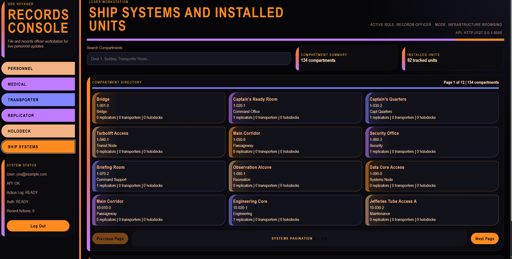
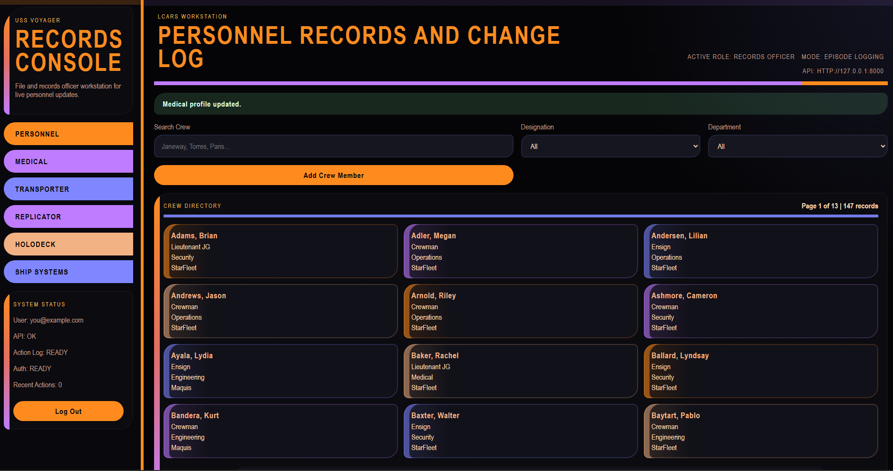
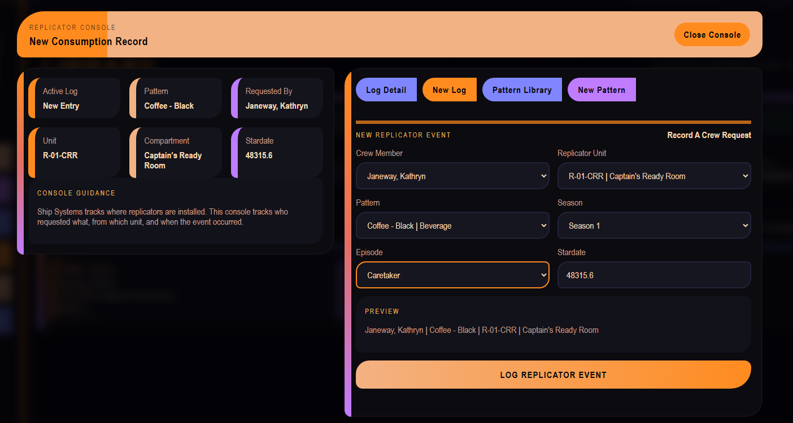

# voyager-database

Star Trek Voyager-inspired database, API, and LCARS workstation for log-driven gameplay.

## Overview

This repository now ships a working V1 records console built around a Voyager-flavored MySQL schema, a FastAPI backend, and a React frontend served through the API at `/portal`.

The current app is designed around a "records officer" play loop:

- browse crew files and system catalogs
- log personnel changes, medical activity, transporter events, replicator use, and holodeck sessions
- preserve canon-flavored base data while allowing each authenticated user to layer their own records on top

## V1 Workspaces

The current portal includes these workstation areas:

- `Personnel`
- `Medical`
- `Transporter`
- `Replicator`
- `Holodeck`
- `Ship Systems`

Authentication is enabled in V1, and user-created records are stored in dedicated save-data tables so base reference data stays intact.

## Screenshots

### Ship Systems Workspace



### Personnel Status Feedback



### Replicator Console



## Data Model Snapshot

### Base schema

Core reference tables live under [`sql/schema/v1`](./sql/schema/v1) and include:

- crew and departments
- former crew records
- ship compartments
- replicator units, patterns, and logs
- transporter units
- holodecks, holodeck programs, and holodeck usage logs
- medical profiles and records
- shuttle roster data retained as catalog/reference data

### User save-data schema

The app also relies on per-user tables for interactive play:

- `users`
- `user_sessions`
- `user_custom_crew`
- `user_personnel_actions`
- `user_medical_profiles`
- `user_medical_records`
- `user_replicator_patterns`
- `user_replicator_logs`
- `user_holodeck_programs`
- `user_holodeck_logs`
- `user_transporter_events`
- `user_transporter_event_passengers`

This split lets the portal merge canon-style seed data with user-authored records without mutating the reference catalog.

## Repository Structure

```text
voyager-database/
|-- api/                     FastAPI backend and auth/session handling
|-- docs/                    ERD notes, roadmap, and design docs
|-- frontend/                React LCARS portal
|-- sql/
|   |-- schema/v1/           Base schema and user-data schema
|   `-- voyager_reference_data.sql
|-- LICENSE
`-- README.md
```

## Running Locally

### 1. Configure the API

Create `api/.env` from your local template and set:

```env
DB_HOST=your_mysql_host
DB_PORT=3306
DB_USER=your_mysql_user
DB_PASSWORD=your_mysql_password
DB_NAME=Voyager_Database
APP_AUTH_SECRET=replace-me
```

If MySQL is hosted on another machine, use that machine's LAN address for `DB_HOST`.

### 2. Load the schema

Apply:

- [`sql/schema/v1/voyager_schema.sql`](./sql/schema/v1/voyager_schema.sql)
- [`sql/schema/v1/voyager_user_data.sql`](./sql/schema/v1/voyager_user_data.sql)
- [`sql/voyager_reference_data.sql`](./sql/voyager_reference_data.sql)

### 3. Start the API

From [`api`](./api):

```powershell
python -m uvicorn src.main:app --reload
```

### 4. Start or rebuild the frontend

From [`frontend`](./frontend):

```powershell
npm install
npm run build
```

The production build is served by FastAPI, so the portal is available at:

- `http://127.0.0.1:8000/portal`
- `http://127.0.0.1:8000/docs`

## Current API Shape

V1 is no longer read-only. The backend currently supports:

- health and auth endpoints
- crew directory and dossier endpoints
- personnel action logging
- medical profile and visit writes
- replicator pattern and usage writes
- transporter event logging with ordered passengers
- holodeck program creation and holodeck usage logging
- ship systems browsing and compartment detail lookup

## Documentation

Primary references:

- [`docs/ERD/ERD_DESCRIPTION.md`](./docs/ERD/ERD_DESCRIPTION.md)
- [`docs/roadmap.md`](./docs/roadmap.md)
- [`docs/records_officer_mvp.md`](./docs/records_officer_mvp.md)

## V1 Notes

- The portal is intentionally optimized for a playable V1 rather than a fully decomposed backend architecture.
- Shuttle data remains in the base schema, but shuttle logging is not an active workstation flow in V1.
- Holodeck programs treat `HolodeckID` as a home/origin bay, while actual usage is tracked in `holodeckusagelog` and `user_holodeck_logs`.

## License

MIT
